# Hi there!  I'm Shibam Banerjee 🚀

<div align="center">
  
</div>

<div align="center">
  <a href="mailto:Connect-With-Shibam@outlook.com">
    
  </a>
  <a href="https://iam-shibam-dev.vercel.app">
    
  </a>
  
</div>

<div align="center">
  
</div>

---

## 🚀 About Me

```javascript
const shibam = {
    name: "Shibam Banerjee",
    location: "Kolkata, India 🇮🇳",
    education: {
        degree: "MCA & BCA Graduate",
        specialization: "Computer Applications"
    },
    currentRole: "Frontend Web Developer",
    portfolio: "https://iam-shibam-dev.vercel.app",
    experience: "2+ years building modern web applications",
    
    code: ["JavaScript", "HTML", "CSS", "React", "Next.js", "TypeScript"],
    technologies: {
        frontend: ["React", "Next.js", "Tailwind CSS", "Framer Motion"],
        styling: ["CSS3", "SCSS", "Tailwind", "Bootstrap"],
        tools: ["Git", "VS Code", "Figma", "Photoshop", "Vercel"],
        databases: ["MongoDB", "MySQL"],
        currentlyLearning: ["TypeScript", "Node.js", "Three.js", "GSAP"]
    },
    
    projects: {
        total: "24+ live projects",
        featured: ["Portfolio", "E-commerce", "API Integrations", "Utilities"],
        deployment: "Vercel, GitHub Pages"
    },
    
    funFacts: [
        "🎨 I love creating neon cyber aesthetics",
        "⚡ I'm passionate about smooth animations",
        "🌟 Always exploring new web technologies",
        "🎯 Building pixel-perfect user interfaces",
        "🚀 24+ projects deployed and counting!"
    ]
};
```

---

## 🛠️ Tech Stack

<div align="center">

### Frontend Technologies


### Styling & Animation


### Tools & Platforms


</div>

---

## 📊 GitHub Stats

<div align="center">
  
  
</div>

<div align="center">
  
</div>

<div align="center">
  
</div>

---

## 🏆 Achievements

<div align="center">

🎯 **Portfolio Highlights**
- 🚀 Built responsive portfolio with Next.js 14
- ⚡ Implemented smooth animations with Framer Motion & GSAP
- 🎨 Designed neon cyber aesthetic UI/UX
- 📱 Created mobile-first responsive designs
- 🔍 SEO optimized with perfect Lighthouse scores

🌟 **Recent Accomplishments**
- ✅ Completed MCA degree with distinction
- 🎓 Built 24+ diverse frontend projects
- 💼 Created multiple professional portfolio websites
- 🎯 Mastered modern React & Next.js ecosystem
- 🚀 Successfully deployed projects on Vercel & GitHub Pages
- 🔧 Developed utility apps, games, and business tools
- 🌐 Integrated multiple external APIs (Weather, Pokémon, RPG)
- 📱 Achieved 100% responsive design across all projects

</div>

---

## 🎯 Featured Projects

<div align="center">

[](https://github.com/Shibam-Code-Pro/iam-shibam-dev)

### 🌐 **[Live Portfolio](https://iam-shibam-dev.vercel.app)**
*Modern Next.js portfolio with neon cyber aesthetic*

**✨ Key Features:**
```
🎬 Cinematic loading animations with smooth transitions
🎨 Glassmorphism design elements and modern UI/UX  
⚡ Lightning-fast performance with Next.js optimization
📱 Fully responsive design across all devices
🔍 SEO optimized with perfect Lighthouse scores
🚀 Deployed on Vercel with continuous integration
```

<p>
  <a href="https://iam-shibam-dev.vercel.app" target="_blank">
    
  </a>
  <a href="https://github.com/Shibam-Code-Pro/iam-shibam-dev" target="_blank">
    
  </a>
</p>

</div>

---

## 🎨 Projects Showcase

<div align="center">

### 🚀 Web Applications & Tools

<table>
<tr>
<td width="50%" align="center" style="vertical-align: top; height: 400px;">
<h4>🦸‍♂️ Avengers Creature Search App</h4>
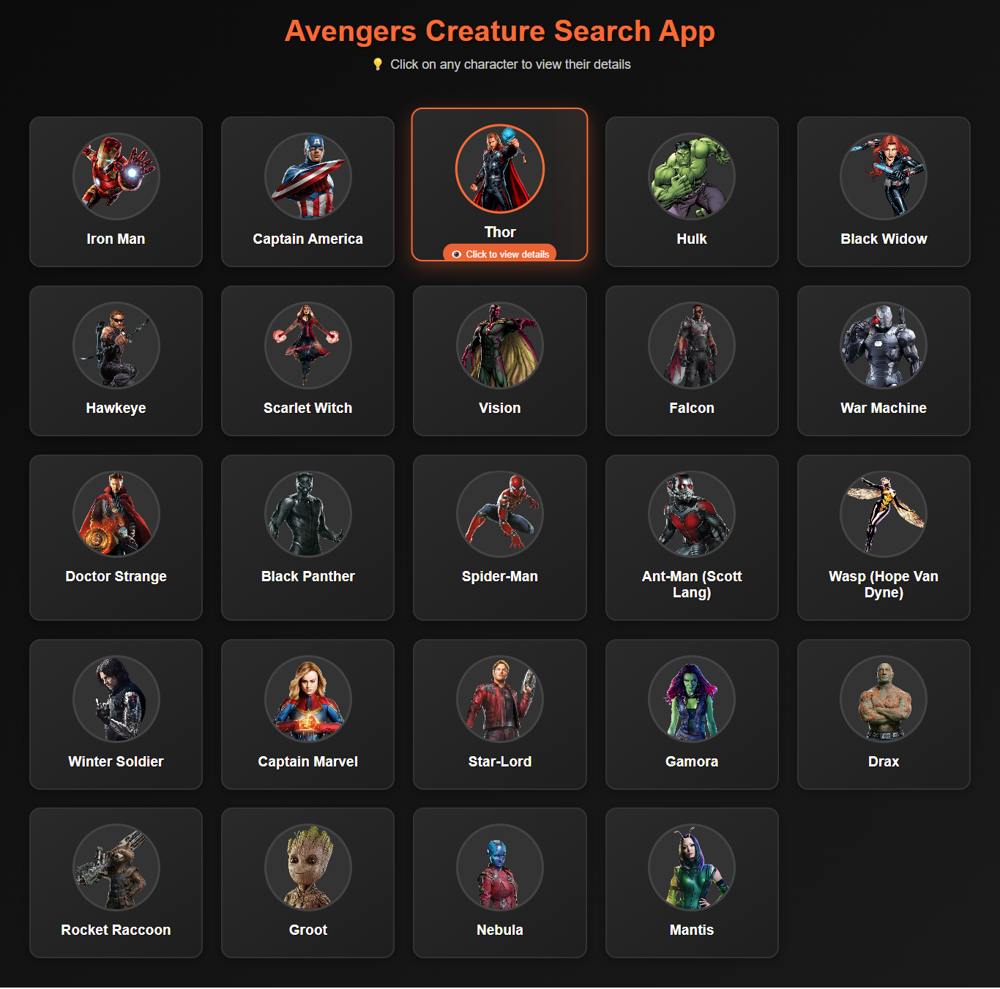
<p><em>Interactive Marvel characters explorer with modal popups</em></p>
<p>
  <a href="https://avengers-creature-search-app-shibam.vercel.app" target="_blank">
    
  </a>
  <a href="https://github.com/Shibam-Code-Pro/avengers-creature-search-app-shibam" target="_blank">
    
  </a>
</p>
</td>
<td width="50%" align="center" style="vertical-align: top; height: 400px;">
<h4>📝 Modern Blog Application</h4>
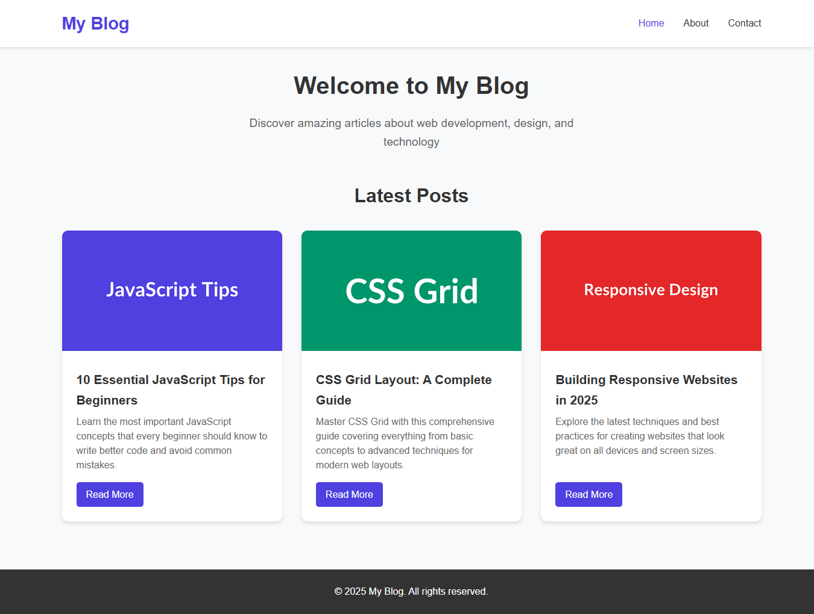
<p><em>WordPress-powered blog with custom theme integration</em></p>
<p>
  <a href="https://blog-app-shibam.vercel.app" target="_blank">
    
  </a>
  <a href="https://github.com/Shibam-Code-Pro/blog-app-shibam" target="_blank">
    
  </a>
</p>
</td>
</tr>
<tr>
<td width="50%" align="center" style="vertical-align: top; height: 400px;">
<h4>💰 Cash Register System</h4>
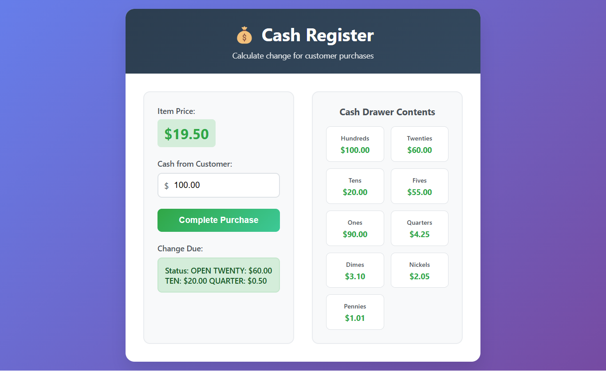
<p><em>Professional POS system with currency breakdown</em></p>
<p>
  <a href="https://cash-register-app-shibam.vercel.app" target="_blank">
    
  </a>
  <a href="https://github.com/Shibam-Code-Pro/cash-register-app-shibam" target="_blank">
    
  </a>
</p>
</td>
<td width="50%" align="center" style="vertical-align: top; height: 400px;">
<h4>🛒 E-Commerce Cart</h4>
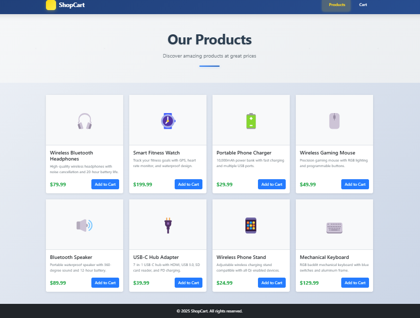
<p><em>Dynamic shopping cart with localStorage persistence</em></p>
<p>
  <a href="https://ecommerce-cart-shibam.vercel.app" target="_blank">
    
  </a>
  <a href="https://github.com/Shibam-Code-Pro/ecommerce-cart-shibam" target="_blank">
    
  </a>
</p>
</td>
</tr>
<tr>
<td width="50%" align="center" style="vertical-align: top; height: 400px;">
<h4>🎨 Figma to HTML Conversion</h4>

<p><em>Pixel-perfect design to responsive HTML/CSS</em></p>
<p>
  <a href="https://figma-to-html-shibam.vercel.app" target="_blank">
    
  </a>
  <a href="https://github.com/Shibam-Code-Pro/figma-to-html-shibam" target="_blank">
    
  </a>
</p>
</td>
<td width="50%" align="center" style="vertical-align: top; height: 400px;">
<h4>🔍 Google Homepage Clone</h4>
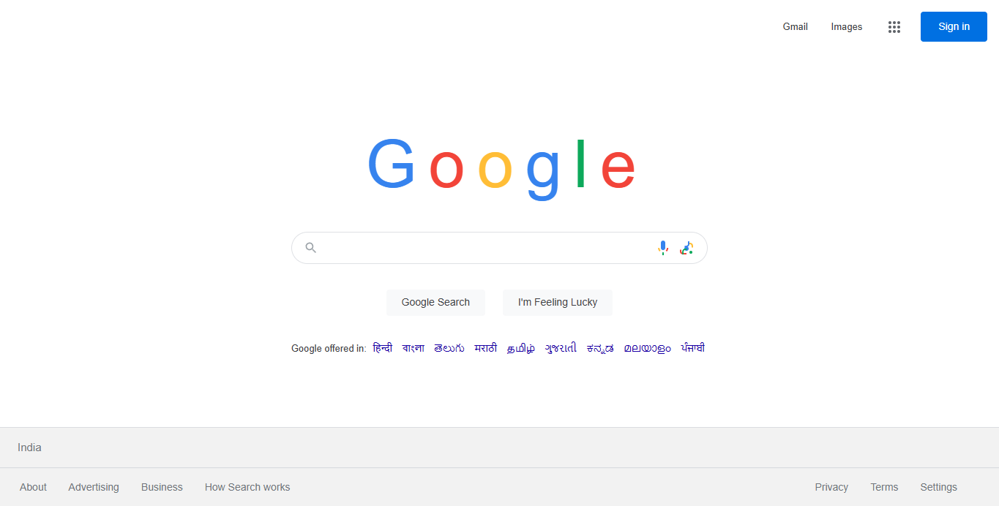
<p><em>Clean, minimal search interface recreation</em></p>
<p>
  <a href="https://google-homepage-shibam.vercel.app" target="_blank">
    
  </a>
  <a href="https://github.com/Shibam-Code-Pro/google-homepage-shibam" target="_blank">
    
  </a>
</p>
</td>
</tr>
<tr>
<td width="50%" align="center" style="vertical-align: top; height: 400px;">
<h4>🧩 Mini Web Components Library</h4>
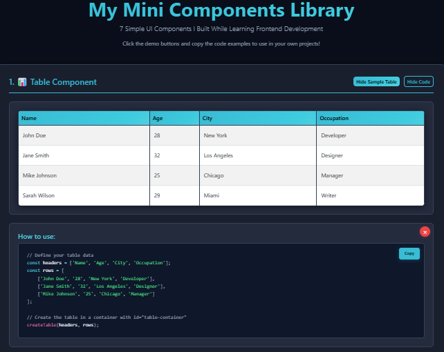
<p><em>Reusable UI components with vanilla JavaScript</em></p>
<p>
  <a href="https://mini-web-components-library-shibam.vercel.app" target="_blank">
    
  </a>
  <a href="https://github.com/Shibam-Code-Pro/mini-web-components-library-shibam" target="_blank">
    
  </a>
</p>
</td>
<td width="50%" align="center" style="vertical-align: top; height: 400px;">
<h4>🔤 Palindrome Checker</h4>
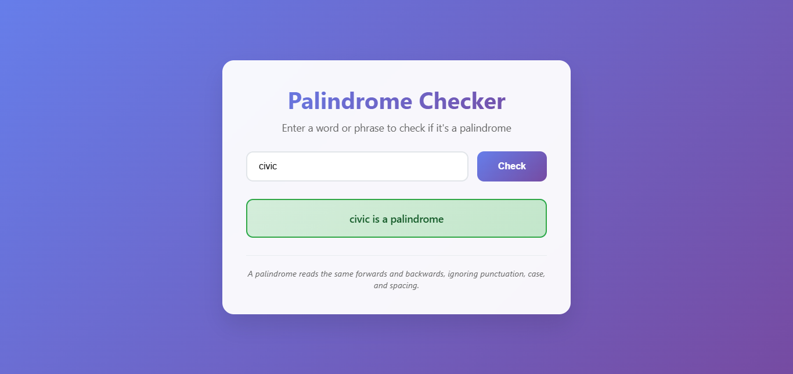
<p><em>Smart text analysis with intelligent processing</em></p>
<p>
  <a href="https://palindrome-checker-app-shibam.vercel.app" target="_blank">
    
  </a>
  <a href="https://github.com/Shibam-Code-Pro/palindrome-checker-app-shibam" target="_blank">
    
  </a>
</p>
</td>
</tr>
<tr>
<td width="50%" align="center" style="vertical-align: top; height: 400px;">
<h4>💼 Personal Portfolio</h4>
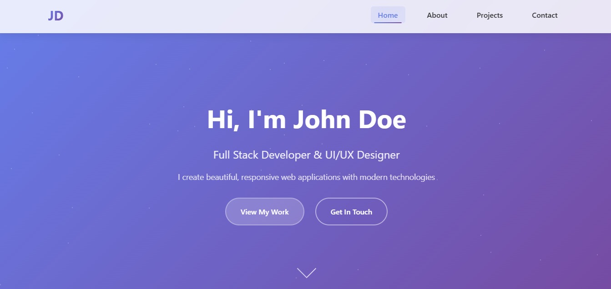
<p><em>Modern portfolio with smooth animations</em></p>
<p>
  <a href="https://personal-portfolio-webpage-shibam.vercel.app" target="_blank">
    
  </a>
  <a href="https://github.com/Shibam-Code-Pro/personal-portfolio-webpage-shibam" target="_blank">
    
  </a>
</p>
</td>
<td width="50%" align="center" style="vertical-align: top; height: 400px;">
<h4>🐾 Pokémon Search App</h4>

<p><em>Comprehensive Pokédex with PokéAPI integration</em></p>
<p>
  <a href="https://pokemon-creature-search-app-shibam.vercel.app" target="_blank">
    
  </a>
  <a href="https://github.com/Shibam-Code-Pro/pokemon-creature-search-app-shibam" target="_blank">
    
  </a>
</p>
</td>
</tr>
<tr>
<td width="50%" align="center" style="vertical-align: top; height: 400px;">
<h4>🎯 Portfolio Website</h4>
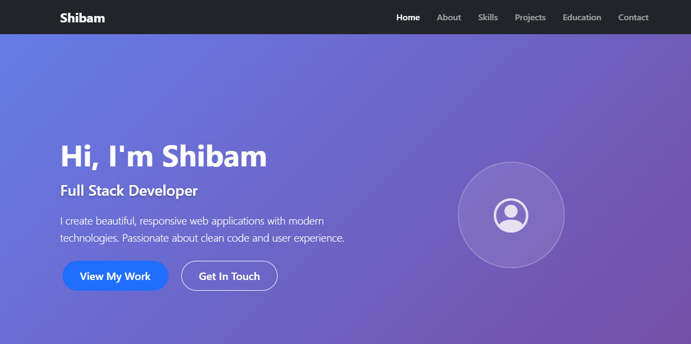
<p><em>Responsive portfolio with Bootstrap framework</em></p>
<p>
  <a href="https://portfolio-shibam.vercel.app" target="_blank">
    
  </a>
  <a href="https://github.com/Shibam-Code-Pro/portfolio-shibam" target="_blank">
    
  </a>
</p>
</td>
<td width="50%" align="center" style="vertical-align: top; height: 400px;">
<h4>📦 Product Landing Page</h4>
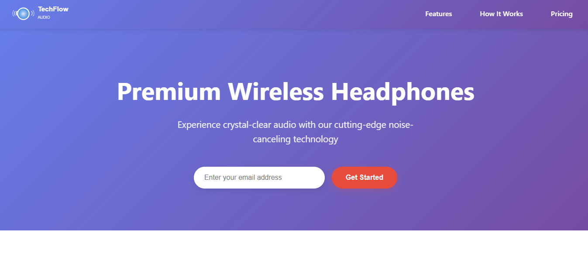
<p><em>Modern product showcase with pricing plans</em></p>
<p>
  <a href="https://product-landing-page-shibam.vercel.app" target="_blank">
    
  </a>
  <a href="https://github.com/Shibam-Code-Pro/product-landing-page-shibam" target="_blank">
    
  </a>
</p>
</td>
</tr>
<tr>
<td width="50%" align="center" style="vertical-align: top; height: 400px;">
<h4>🏛️ Roman Numeral Converter</h4>
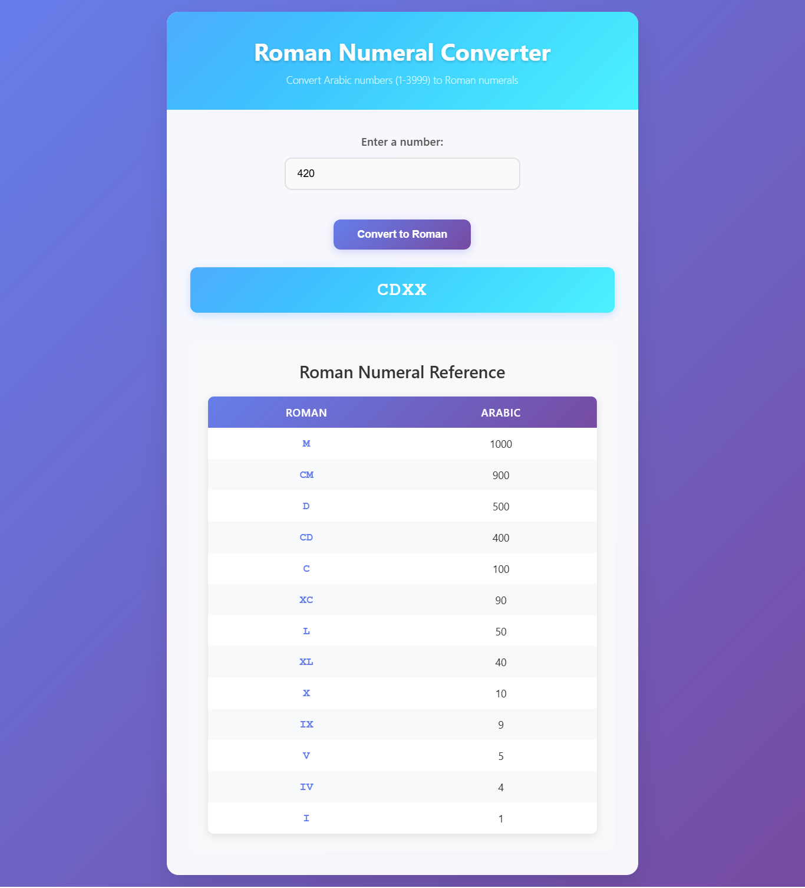
<p><em>Elegant converter with comprehensive reference</em></p>
<p>
  <a href="https://roman-numeral-converter-app-shibam.vercel.app" target="_blank">
    
  </a>
  <a href="https://github.com/Shibam-Code-Pro/roman-numeral-converter-app-shibam" target="_blank">
    
  </a>
</p>
</td>
<td width="50%" align="center" style="vertical-align: top; height: 400px;">
<h4>🎲 RPG Creature Search</h4>
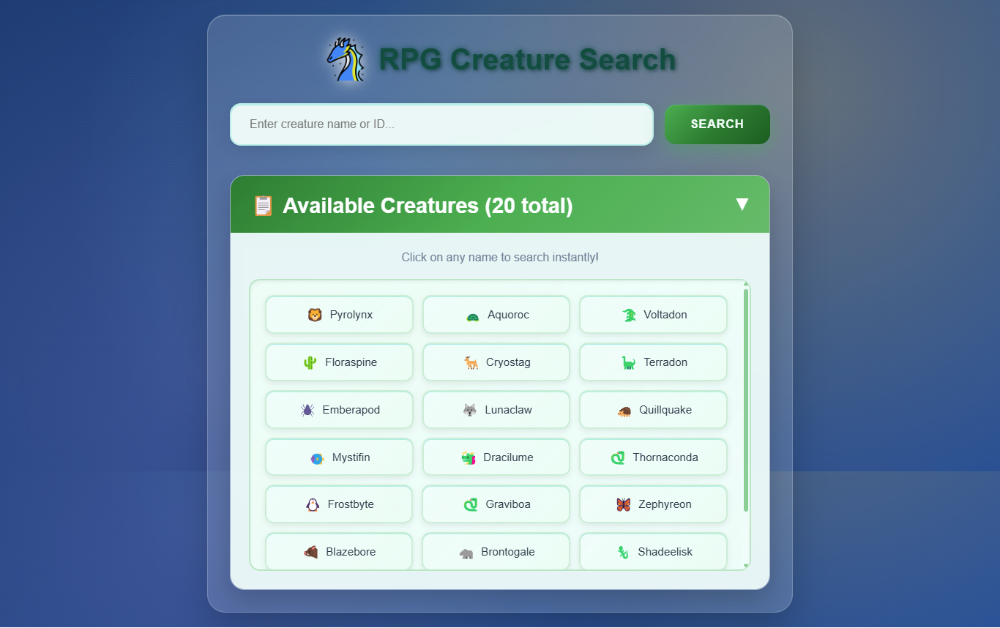
<p><em>Fantasy creature explorer with detailed stats</em></p>
<p>
  <a href="https://rpg-creature-search-app-shibam.vercel.app" target="_blank">
    
  </a>
  <a href="https://github.com/Shibam-Code-Pro/rpg-creature-search-app-shibam" target="_blank">
    
  </a>
</p>
</td>
</tr>
<tr>
<td width="50%" align="center" style="vertical-align: top; height: 400px;">
<h4>🧮 Scientific Calculator</h4>
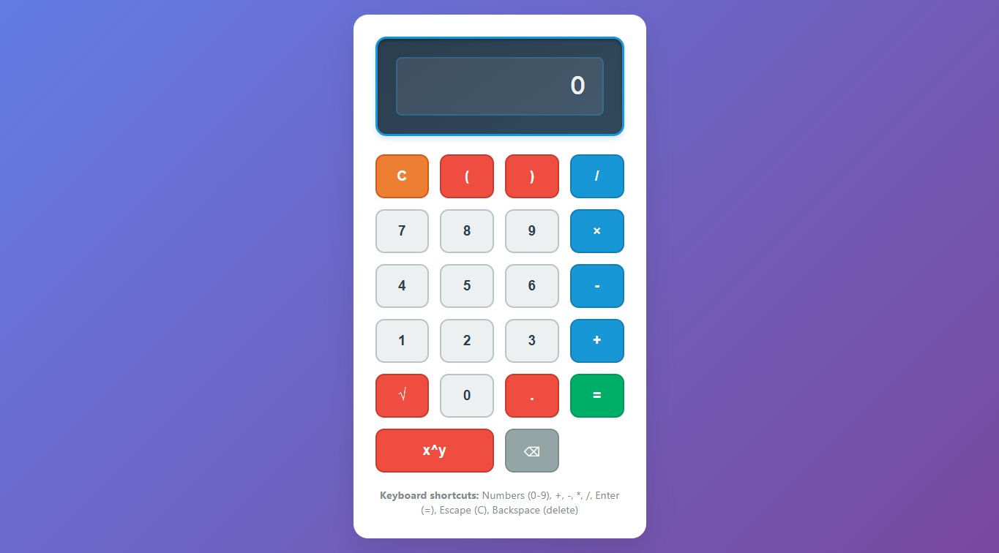
<p><em>Advanced calculator with scientific functions</em></p>
<p>
  <a href="https://scientific-calculator-shibam.vercel.app" target="_blank">
    
  </a>
  <a href="https://github.com/Shibam-Code-Pro/scientific-calculator-shibam" target="_blank">
    
  </a>
</p>
</td>
<td width="50%" align="center" style="vertical-align: top; height: 400px;">
<h4>📋 Survey Form</h4>
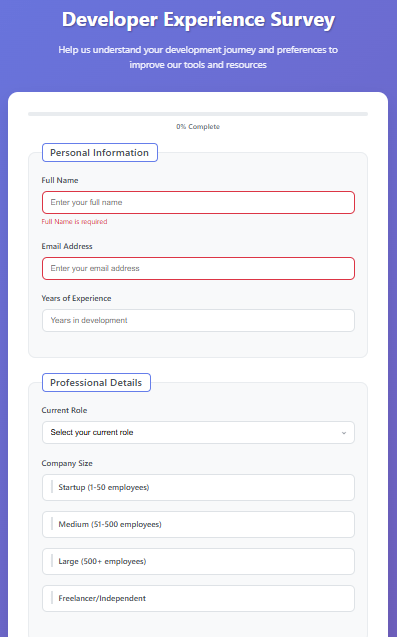
<p><em>Comprehensive form with validation & accessibility</em></p>
<p>
  <a href="https://survey-form-shibam.vercel.app" target="_blank">
    
  </a>
  <a href="https://github.com/Shibam-Code-Pro/survey-form-shibam" target="_blank">
    
  </a>
</p>
</td>
</tr>
<tr>
<td width="50%" align="center" style="vertical-align: top; height: 400px;">
<h4>📚 Technical Documentation</h4>
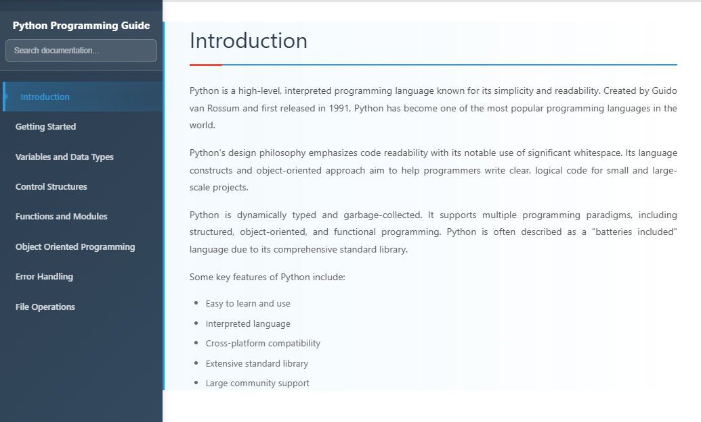
<p><em>Python documentation with syntax highlighting</em></p>
<p>
  <a href="https://technical-documentation-page-shibam.vercel.app" target="_blank">
    
  </a>
  <a href="https://github.com/Shibam-Code-Pro/technical-documentation-page-shibam" target="_blank">
    
  </a>
</p>
</td>
<td width="50%" align="center" style="vertical-align: top; height: 400px;">
<h4>📞 Phone Number Validator</h4>
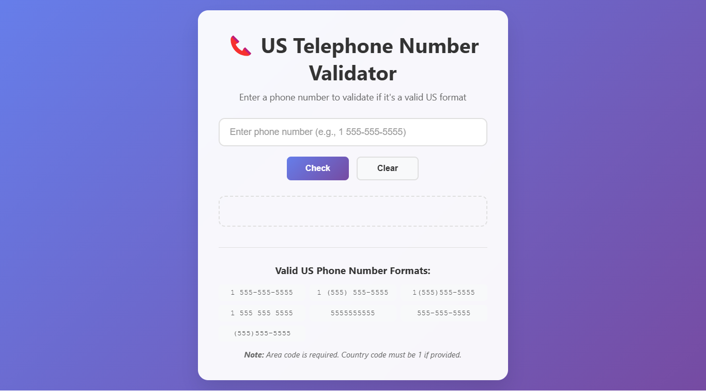
<p><em>US phone number validation with pattern recognition</em></p>
<p>
  <a href="https://telephone-number-validator-app-shibam.vercel.app" target="_blank">
    
  </a>
  <a href="https://github.com/Shibam-Code-Pro/telephone-number-validator-app-shibam" target="_blank">
    
  </a>
</p>
</td>
</tr>
<tr>
<td width="50%" align="center" style="vertical-align: top; height: 400px;">
<h4>✅ To-Do List App</h4>
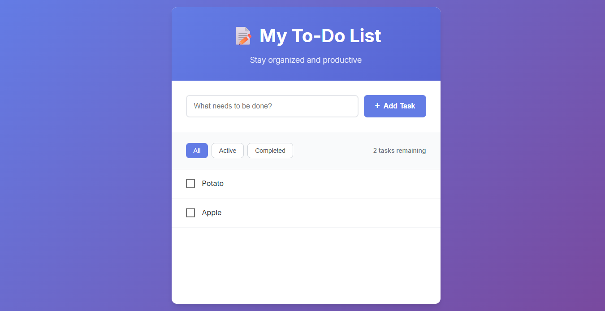
<p><em>Modern task manager with CRUD operations</em></p>
<p>
  <a href="https://to-do-list-shibam.vercel.app" target="_blank">
    
  </a>
  <a href="https://github.com/Shibam-Code-Pro/to-do-list-shibam" target="_blank">
    
  </a>
</p>
</td>
<td width="50%" align="center" style="vertical-align: top; height: 400px;">
<h4>🏆 Tribute Page</h4>
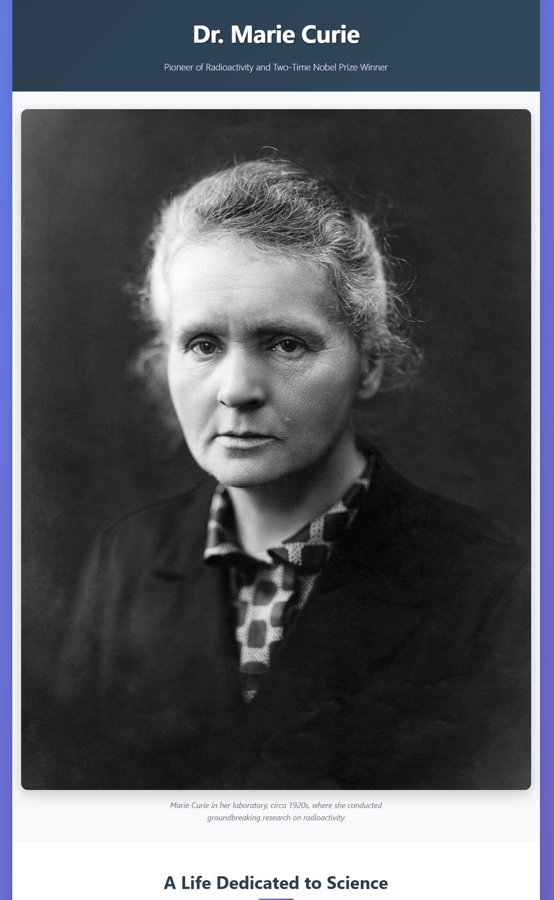
<p><em>Elegant tribute to Dr. Marie Curie with timeline</em></p>
<p>
  <a href="https://tribute-page-shibam.vercel.app" target="_blank">
    
  </a>
  <a href="https://github.com/Shibam-Code-Pro/tribute-page-shibam" target="_blank">
    
  </a>
</p>
</td>
</tr>
<tr>
<td width="50%" align="center" style="vertical-align: top; height: 400px;">
<h4>🌤️ Weather Application</h4>
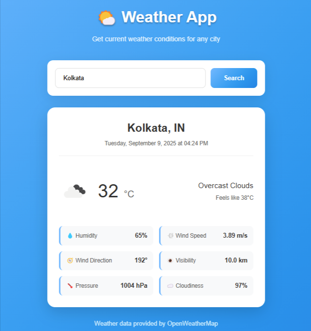
<p><em>Dynamic weather app with external API integration</em></p>
<p>
  <a href="https://weather-app-shibam.vercel.app" target="_blank">
    
  </a>
  <a href="https://github.com/Shibam-Code-Pro/weather-app-shibam" target="_blank">
    
  </a>
</p>
</td>
<td width="50%" align="center" style="vertical-align: top; height: 400px;">
<h4>🍰 Cake Shop Website</h4>
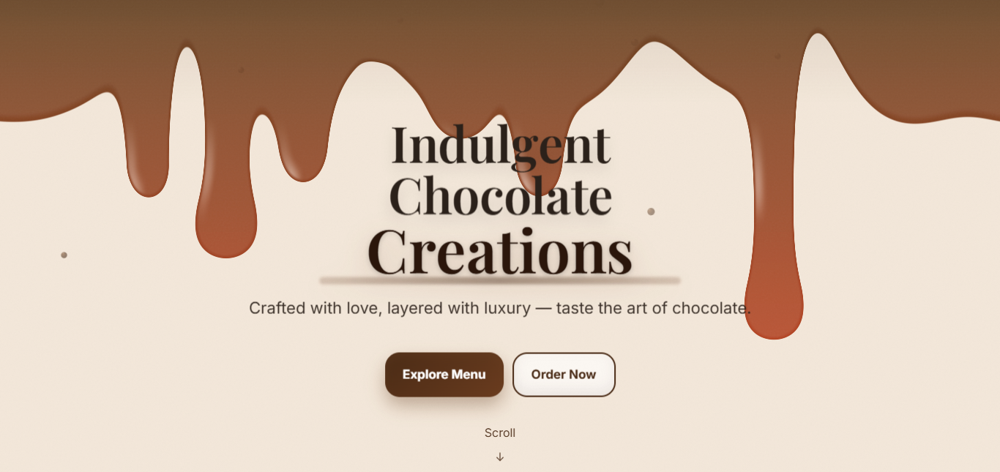
<p><em>Beautiful bakery website with product showcase</em></p>
<p>
  <a href="https://cake-shop-shibam.vercel.app" target="_blank">
    
  </a>
  <a href="https://github.com/Shibam-Code-Pro/cake-shop-shibam" target="_blank">
    
  </a>
</p>
</td>
</tr>
<tr>
<td colspan="2" align="center">
<h4>📝 Web Development Notes</h4>
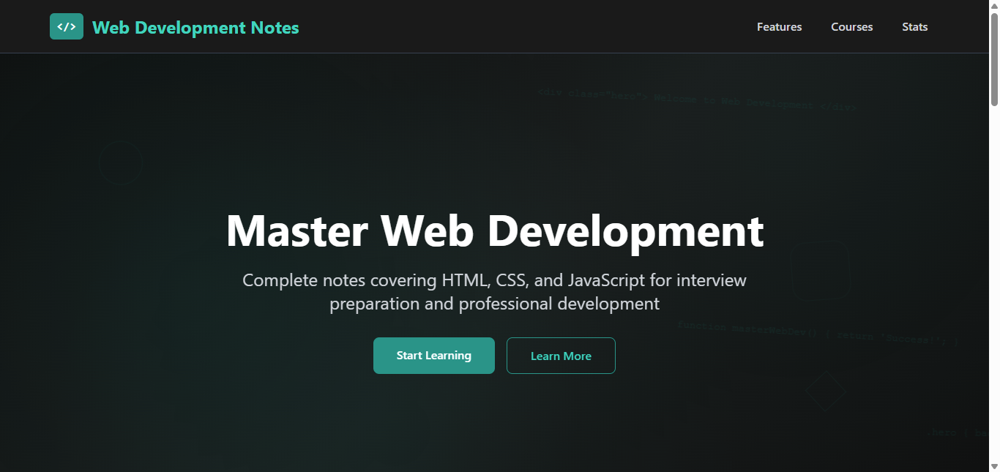
<p><em>Comprehensive web development reference and notes</em></p>
<p>
  <a href="https://web-development-notes-shibam.vercel.app" target="_blank">
    
  </a>
  <a href="https://github.com/Shibam-Code-Pro/web-development-notes-shibam" target="_blank">
    
  </a>
</p>
</td>
</tr>
</table>

### 📊 Project Statistics
- **24+ Live Projects** deployed and functional
- **Multiple Tech Stacks** - HTML, CSS, JavaScript, React, Next.js, Bootstrap
- **API Integrations** - Weather API, PokéAPI, RPG Creature API
- **Responsive Design** - Mobile-first approach across all projects
- **Modern UI/UX** - Clean, intuitive interfaces with smooth animations

</div>

---

## 📈 Coding Activity

<div align="center">
  
</div>

<div align="center">
  
  
</div>

---

## 🎨 Fun Facts

<div align="center">

```
🎯 I'm passionate about creating pixel-perfect user interfaces
⚡ Love experimenting with CSS animations and micro-interactions  
🌟 Always exploring the latest frontend technologies and trends
🎨 Enjoy designing with neon colors and futuristic aesthetics
🚀 Building projects that combine functionality with visual appeal
📚 Continuous learner - currently diving into TypeScript and Three.js
🏆 Proud creator of 24+ live web applications and tools
💡 Specialized in API integrations and dynamic web experiences
```

</div>

---

## ⚡ Quick Skills Overview

<div align="center">

**Frontend Development**
```
🚀 React & Next.js    ████████████████████ 100%
⚡ JavaScript (ES6+)  ████████████████████ 100%
🎨 HTML5 & CSS3       ████████████████████ 100%
💫 Tailwind CSS       ██████████████████░░  90%
🎭 Framer Motion      ████████████████░░░░  80%
```

**Tools & Platforms**
```
🛠️ Git & GitHub       ████████████████████ 100%
🎯 VS Code            ████████████████████ 100%
🎨 Figma              ██████████████████░░  90%
🚀 Vercel Deployment  ████████████████████ 100%
📊 API Integration    ██████████████████░░  90%
```

</div>

---

## 📬 Get In Touch

<div align="center">

💼 **Open to opportunities:** Frontend Developer roles, Freelance projects  
📧 **Response time:** Usually within 24 hours  
🌍 **Location:** Kolkata, India (Open to remote work)  
🚀 **Currently Working On:** TypeScript migration & Three.js experiments

</div>

---

## 🤝 Let's Connect!

<div align="center">

[](https://iam-shibam-dev.vercel.app)
[](https://linkedin.com/in/shibam-webdev)
[](mailto:Connect-With-Shibam@outlook.com)
[](https://github.com/Shibam-Code-Pro)

</div>

<div align="center">
  
</div>

---

<div align="center">
  
</div>

---

<div align="center">
  <i>⭐ From <a href="https://github.com/Shibam-Code-Pro">Shibam Banerjee</a> - Building the future, one line of code at a time! ⭐</i>
  <br><br>
  
</div>
